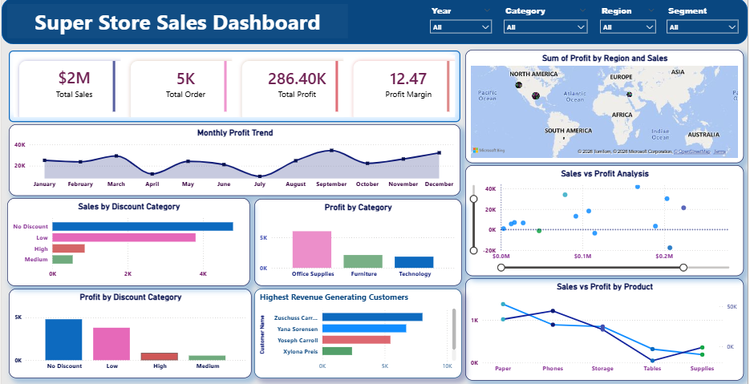

Project 1: 

🛒 Superstore Sales Dashboard  
"Turning Retail Data into Profit Strategies"

📌 Problem
The Superstore has thousands of transactions across different regions and categories, making it difficult to identify where the business is making or losing money.

💡 Solution
This dashboard provides a 360-degree view of retail performance:
- Monthly Profit Trend to identify seasonal patterns  
- Map Visualization for regional sales performance  
- Scatter Plot to analyze Sales vs Profit relationship  

 📊 Key Insight
The Discount Category analysis shows that high discounts negatively impact profit margins, helping identify products that need pricing strategy adjustments.

 🛠 Tools Used
- Power BI  
- Excel  
- DAX  
- Data Modeling  

 📷 Dashboard Preview

📁 Files Included
- Dataset (Excel)
- Power BI Dashboard (.pbix)
