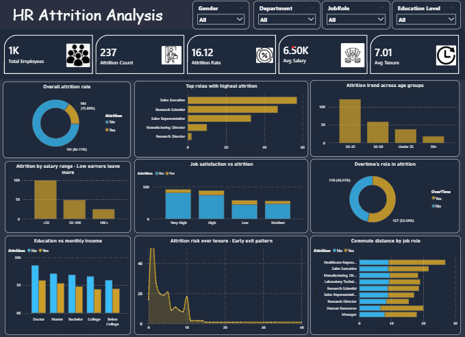

Project 2: 
👥 HR Attrition Analysis  
Data-Driven Retention for Workforce Planning

 📌 Problem
Employee attrition increases hiring costs and affects organizational stability. The challenge is to identify patterns behind employee turnover.

💡 Solution
Built an interactive HR analytics dashboard to analyze employee attrition across different factors such as salary, job role, age, and tenure.

Key features:
- Attrition rate overview with KPIs  
- Job role-based attrition analysis  
- Salary band impact on attrition  
- Tenure-based attrition trend  
- Overtime and job satisfaction analysis  

 📊 Key Insights
- Employees are most likely to leave within their first 2 years (early exit pattern)  
- Lower salary bands show higher attrition rates  
- Sales Executives and Sales Representatives have the highest attrition  
- Employees working overtime tend to leave more frequently  

🛠 Tools & Technologies
- Power BI  
- Excel  
- Data Visualization  
- HR Analytics  

📷 Dashboard Preview

 📁 Files Included
- Dataset (HR-Employee-Attrition.xlsx)  
- Dashboard (.pbix file)  

🎯 Outcome
This dashboard enables HR teams to identify risk factors and take proactive measures to improve employee retention.
