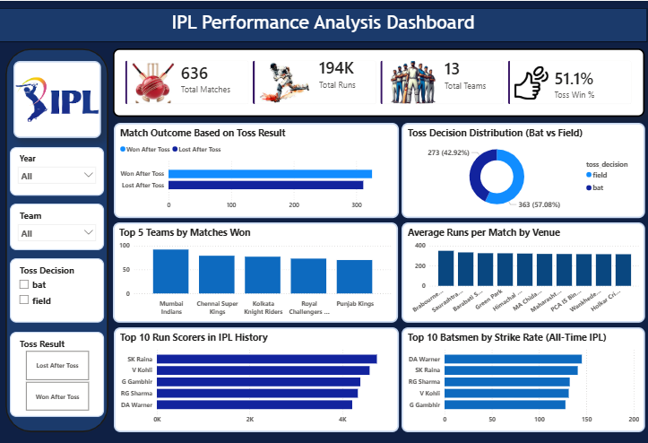

🏏 IPL Performance Analysis Dashboard  
Data-Driven Insights into Cricket Performance

📌 Problem
IPL generates large amounts of match data, making it difficult to analyze team performance, player statistics, and match outcomes efficiently.

💡 Solution
Developed an interactive Power BI dashboard to analyze IPL match data and uncover insights related to teams, players, and match outcomes.

Key features:
- Match outcome analysis based on toss results  
- Toss decision distribution (bat vs field)  
- Top 5 teams by matches won  
- Player performance (strike rate)  
- Venue-wise average runs analysis  

📊 Key Insights
- Teams winning the toss have a slightly higher chance of winning the match  
- Majority of teams prefer fielding after winning the toss  
- Mumbai Indians and Chennai Super Kings are among the top-performing teams  
- Top players like Virat Kohli and David Warner dominate in runs and strike rate  
- Certain venues consistently produce higher average scores  

 🛠 Tools & Technologies
- Power BI  
- Excel  
- Data Visualization  
- DAX  

 📷 Dashboard Preview

 📁 Files Included
- IPL Dataset  
- Power BI Dashboard (.pbix)  

 🎯 Outcome
This dashboard helps analyze team strategies, player performance, and match trends, enabling better understanding of game dynamics.
